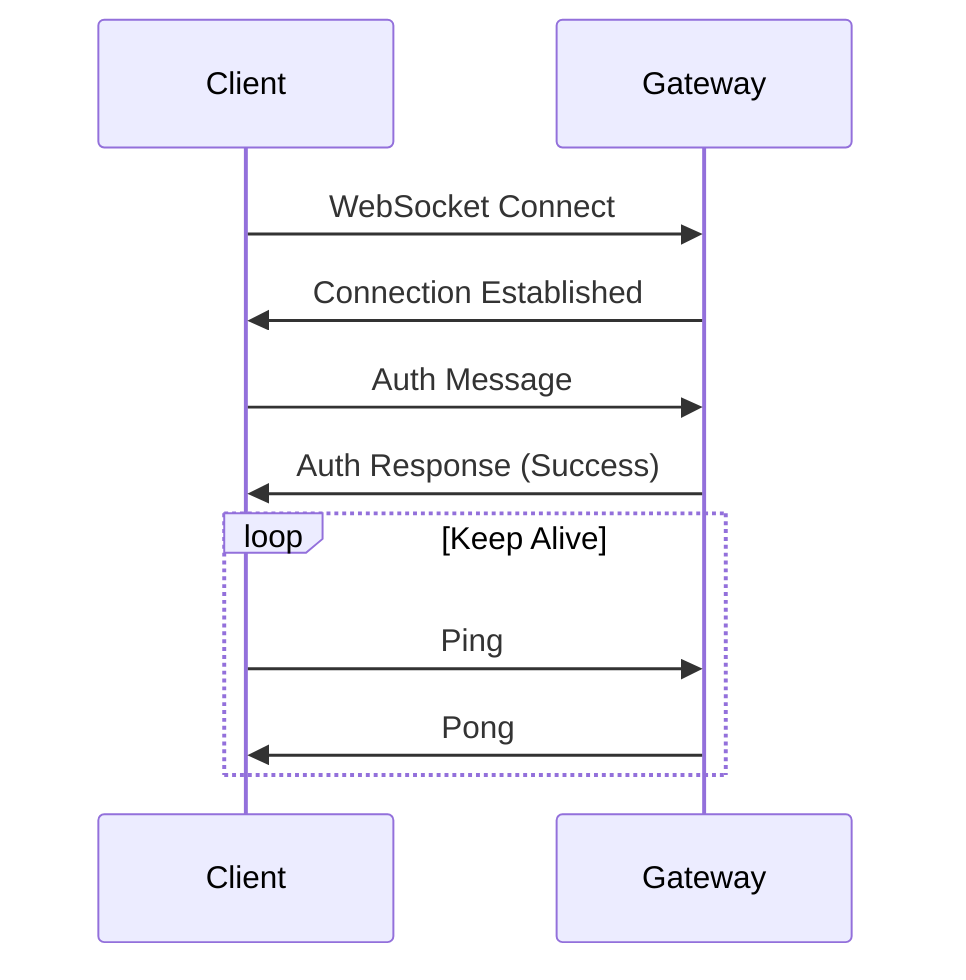
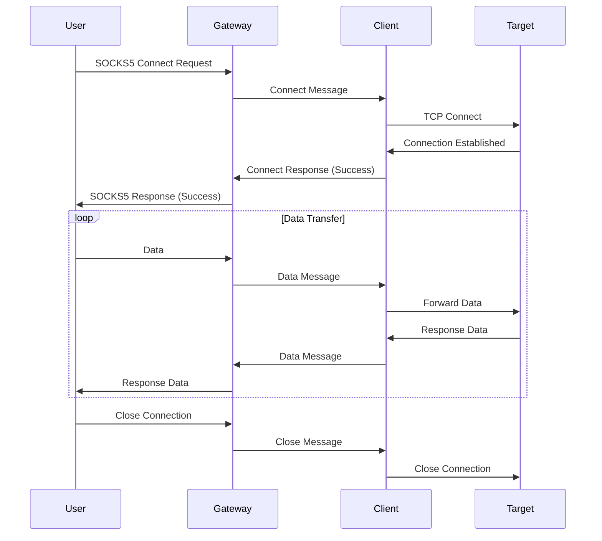

# AnyProxy API 文档

## 概述

AnyProxy 使用 WebSocket + TLS 协议进行客户端和网关之间的通信。本文档描述了通信协议、消息格式和 API 接口。

## WebSocket 连接

### 连接建立

客户端通过 WebSocket 连接到网关：

```
wss://gateway-host:8443/ws
```

### 认证

连接建立后，客户端需要发送认证消息：

```json
{
  "type": "auth",
  "data": {
    "username": "client_username",
    "password": "client_password",
    "client_id": "unique_client_id"
  }
}
```

网关响应：

```json
{
  "type": "auth_response",
  "data": {
    "success": true,
    "message": "Authentication successful"
  }
}
```

## 消息格式

所有消息都使用 JSON 格式，包含以下基本结构：

```json
{
  "type": "message_type",
  "data": {
    // 消息数据
  }
}
```

## 消息类型

### 1. 认证消息 (auth)

**客户端 → 网关**

```json
{
  "type": "auth",
  "data": {
    "username": "string",
    "password": "string", 
    "client_id": "string"
  }
}
```

**网关 → 客户端**

```json
{
  "type": "auth_response",
  "data": {
    "success": boolean,
    "message": "string"
  }
}
```

### 2. 连接请求 (connect)

**网关 → 客户端**

当有新的代理请求时，网关发送连接请求：

```json
{
  "type": "connect",
  "data": {
    "connection_id": "unique_connection_id",
    "target_host": "target.example.com",
    "target_port": 80,
    "protocol": "tcp"
  }
}
```

**客户端 → 网关**

客户端响应连接结果：

```json
{
  "type": "connect_response",
  "data": {
    "connection_id": "unique_connection_id",
    "success": boolean,
    "message": "string"
  }
}
```

### 3. 数据传输 (data)

**双向传输**

用于在网关和客户端之间传输代理数据：

```json
{
  "type": "data",
  "data": {
    "connection_id": "unique_connection_id",
    "payload": "base64_encoded_data"
  }
}
```

### 4. 连接关闭 (close)

**双向传输**

通知对方关闭特定连接：

```json
{
  "type": "close",
  "data": {
    "connection_id": "unique_connection_id",
    "reason": "string"
  }
}
```

### 5. 心跳消息 (ping/pong)

**客户端 → 网关**

```json
{
  "type": "ping",
  "data": {
    "timestamp": 1640995200
  }
}
```

**网关 → 客户端**

```json
{
  "type": "pong",
  "data": {
    "timestamp": 1640995200
  }
}
```

### 6. 错误消息 (error)

**双向传输**

```json
{
  "type": "error",
  "data": {
    "code": "error_code",
    "message": "error_description",
    "connection_id": "optional_connection_id"
  }
}
```

## 错误代码

| 代码 | 描述 |
|------|------|
| `AUTH_FAILED` | 认证失败 |
| `INVALID_MESSAGE` | 无效消息格式 |
| `CONNECTION_FAILED` | 连接目标失败 |
| `FORBIDDEN_HOST` | 禁止访问的主机 |
| `RATE_LIMITED` | 请求频率限制 |
| `INTERNAL_ERROR` | 内部错误 |

## 连接生命周期

### 1. 建立连接



### 2. 代理请求处理



## 配置 API

### SOCKS5 代理配置

```yaml
proxy:
  socks5:
    listen_addr: ":1080"
    auth_username: "optional_username"
    auth_password: "optional_password"
```

### 网关配置

```yaml
gateway:
  listen_addr: ":8443"
  tls_cert: "path/to/cert.pem"
  tls_key: "path/to/key.pem"
  auth_username: "gateway_user"
  auth_password: "gateway_password"
```

### 客户端配置

```yaml
client:
  gateway_addr: "gateway.example.com:8443"
  gateway_tls_cert: "path/to/gateway_cert.pem"
  client_id: "unique_client_identifier"
  replicas: 1
  max_concurrent_conns: 100
  auth_username: "gateway_user"
  auth_password: "gateway_password"
  forbidden_hosts:
    - "internal.company.com"
    - "192.168.0.0/16"
  limit:
    - name: "web-server"
      addr: "localhost:8080"
      protocol: "tcp"
```

## 安全考虑

### 1. TLS 配置

- 使用 TLS 1.2 或更高版本
- 验证服务器证书
- 支持客户端证书认证

### 2. 认证机制

- 基于用户名密码的认证
- 支持自定义认证插件
- 认证失败后的重试限制

### 3. 访问控制

- 基于主机名的黑白名单
- 基于 IP 地址的访问控制
- 协议级别的限制

## 性能优化

### 1. 连接复用

- WebSocket 连接复用
- 连接池管理
- 自动清理空闲连接

### 2. 数据压缩

- 支持 WebSocket 压缩扩展
- 可配置的压缩级别
- 自适应压缩策略

### 3. 缓冲管理

- 可配置的缓冲区大小
- 背压控制机制
- 内存使用优化

## 监控指标

### 连接指标

- 活跃连接数
- 连接建立速率
- 连接失败率
- 平均连接持续时间

### 流量指标

- 入站/出站字节数
- 消息处理速率
- 延迟统计
- 错误率

### 性能指标

- CPU 使用率
- 内存使用量
- 网络带宽使用
- 并发连接数

## 示例代码

### 客户端连接示例

```go
package main

import (
    "crypto/tls"
    "encoding/json"
    "log"
    "net/url"
    
    "github.com/gorilla/websocket"
)

type Message struct {
    Type string      `json:"type"`
    Data interface{} `json:"data"`
}

type AuthData struct {
    Username string `json:"username"`
    Password string `json:"password"`
    ClientID string `json:"client_id"`
}

func main() {
    // 连接到网关
    u := url.URL{Scheme: "wss", Host: "gateway.example.com:8443", Path: "/ws"}
    
    dialer := websocket.Dialer{
        TLSClientConfig: &tls.Config{
            InsecureSkipVerify: false,
        },
    }
    
    conn, _, err := dialer.Dial(u.String(), nil)
    if err != nil {
        log.Fatal("dial:", err)
    }
    defer conn.Close()
    
    // 发送认证消息
    authMsg := Message{
        Type: "auth",
        Data: AuthData{
            Username: "client_user",
            Password: "client_password",
            ClientID: "client_001",
        },
    }
    
    if err := conn.WriteJSON(authMsg); err != nil {
        log.Fatal("write auth:", err)
    }
    
    // 读取认证响应
    var response Message
    if err := conn.ReadJSON(&response); err != nil {
        log.Fatal("read auth response:", err)
    }
    
    log.Printf("Auth response: %+v", response)
    
    // 处理消息循环
    for {
        var msg Message
        if err := conn.ReadJSON(&msg); err != nil {
            log.Printf("read error: %v", err)
            break
        }
        
        // 处理不同类型的消息
        switch msg.Type {
        case "connect":
            handleConnect(conn, msg)
        case "data":
            handleData(conn, msg)
        case "close":
            handleClose(conn, msg)
        case "ping":
            handlePing(conn, msg)
        }
    }
}

func handleConnect(conn *websocket.Conn, msg Message) {
    // 处理连接请求
    log.Printf("Received connect request: %+v", msg.Data)
    
    // 响应连接结果
    response := Message{
        Type: "connect_response",
        Data: map[string]interface{}{
            "connection_id": "extracted_from_msg",
            "success":       true,
            "message":       "Connection established",
        },
    }
    
    conn.WriteJSON(response)
}

func handleData(conn *websocket.Conn, msg Message) {
    // 处理数据传输
    log.Printf("Received data: %+v", msg.Data)
}

func handleClose(conn *websocket.Conn, msg Message) {
    // 处理连接关闭
    log.Printf("Received close: %+v", msg.Data)
}

func handlePing(conn *websocket.Conn, msg Message) {
    // 响应心跳
    response := Message{
        Type: "pong",
        Data: msg.Data,
    }
    conn.WriteJSON(response)
}
```

## 故障排除

### 常见问题

1. **WebSocket 连接失败**
   - 检查网络连通性
   - 验证 TLS 证书
   - 确认端口开放

2. **认证失败**
   - 检查用户名密码
   - 验证客户端 ID
   - 查看认证日志

3. **消息格式错误**
   - 验证 JSON 格式
   - 检查必需字段
   - 确认数据类型

### 调试工具

```bash
# 使用 wscat 测试 WebSocket 连接
npm install -g wscat
wscat -c wss://gateway.example.com:8443/ws

# 使用 openssl 测试 TLS 连接
openssl s_client -connect gateway.example.com:8443

# 查看网络连接
netstat -an | grep 8443
``` 